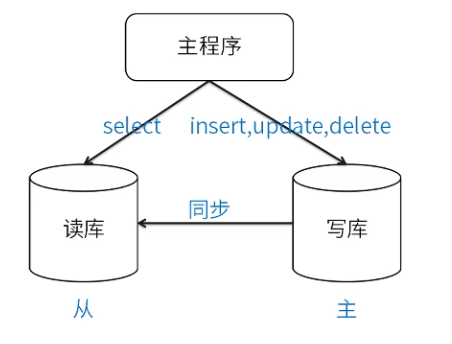
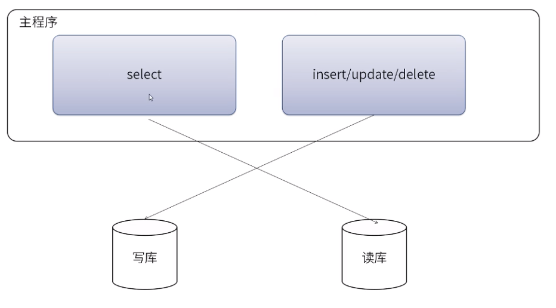
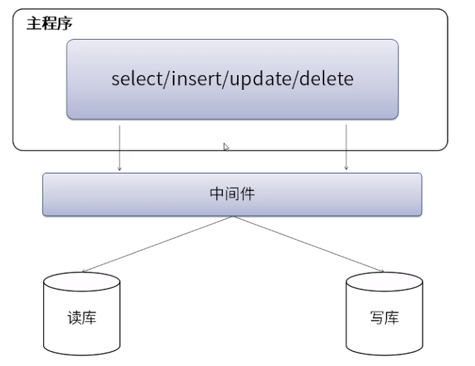
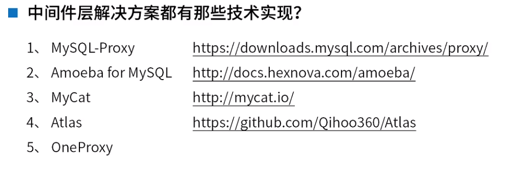
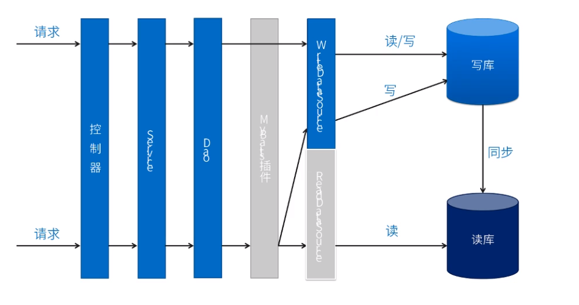

## Spring+MyBatis实现数据库读写分离方案


#### 没有缓存，如何使用读写分离抗住高并发的？

##### 1：了解数据库压力过大之后如何优化

##### 2：熟悉常见的读写分离方案

##### 3：学会使用mybaits plugin实现读写分离


#### 如何应对数据库压力过大

>  随着业务的发展门系统的数据量和访问浪都在大量增长。对于大型网站来说，有不少业务是读多邪少，这个状态也会直接反映在数据库上，特别是电商的特色业务-秒杀，那么对于这样的情况，我们该怎么处理?

大家了解和使用那些解决方案呢？

##### 数据库集群

>  一个主库，负责写入数据，---主库（写库）
>
>  其他都是从库，负责读取数据，我们称之为：读库

&nbsp;

##### 数据库集群，对我们的要求

1：读库和写库的数据一直

2：协数据必须写到写库

3：读数据必须到读库读


#### 应对方案




优点：

1：多数据源切换方法，有程序自动完成

2：不需要引入中间件

3：理论上支持任何数据库

缺点：

1：有程序员完成，运行参与不到

2：不能做到动态增加数据源。

#### 应用层解决方案都有？

1：驱动时间   

​       com.mysql.jdbc.ReplicaitonDriver

​       Sharding-jdbc

2：Mybatis Plugin(SqlType:select update)

3：SpringAop + Mybatis Plugin + 注解

4：Spring 动态数据源 + Mybatis Plugin。

#### 解决方案二：中间件层

、

优点：

1：源程序不需要做任何改动就可以实现读写分离；

2：动态添加数据源不需要重启程序。

缺点：

1：程序依赖于中间件，会导致切换数据库变得困难。

2：由中间件做了中转代理，性能有所下降。

&nbsp;

现在有比使用中间件更好的解决方案，就是运行在公有云上的，基于中间件技术 + 公有云数据库打造成的分布式数据库，目前典型的有阿里云的DRDS/PetaData,腾讯云的DCDB FOR TDSQL，以及ucloud最近推出的UDDB。


#### Spring + Mybatis Plugin 实现读写分离

1：如果你的后台结构是：spring + mybatis 

可以通过spring的AbstractRoutingDataSource和Mybatis Plugin拦截器非常友好的实现读写分离，又有代码不需要任何改变。

 &nbsp;


### 公共部分

#### 数据库脚本

```sql
-- auto Generated on 2019-03-13 14:27:05 
-- DROP TABLE IF EXISTS `user`; 
CREATE TABLE user(
    `id` BIGINT(20) UNSIGNED NOT NULL AUTO_INCREMENT COMMENT 'id',
    `username` VARCHAR(50) NOT NULL DEFAULT '' COMMENT 'username',
    `password` VARCHAR(50) NOT NULL DEFAULT '' COMMENT 'password',
    `name` VARCHAR(50) NOT NULL DEFAULT '' COMMENT 'name',
    PRIMARY KEY (`id`)
)ENGINE=InnoDB DEFAULT CHARSET=utf8mb4 COMMENT 'user';
```

#### Pojo

```java
package com.itbooking.pojo;

import lombok.*;

/**
 * @Author 徐柯老师
 * @Description
 * @Tel/微信：15074816437
 * @Version 1.0
 **/
@Data
@ToString
@AllArgsConstructor
@NoArgsConstructor
@Builder
public class User {
    private Long id;
    private String username;
    private String password;
    private String name;
}

```

#### jdbc.properties

```
# 原来的数据库配置
jdbc.driver=com.mysql.jdbc.Driver
jdbc.url=jdbc:mysql://localhost:3306/tmall?useUnicode=true&characterEncoding=UTF-8
jdbc.username=root
jdbc.password=mkxiaoer

### 读库
jdbc.read.url=jdbc:mysql://localhost:3306/tmall?useUnicode=true&characterEncoding=UTF-8
jdbc.read.username=root
jdbc.read.password=mkxiaoer

### 写库
jdbc.write.url=jdbc:mysql://localhost:3306/tmall2?useUnicode=true&characterEncoding=UTF-8
jdbc.write.username=root
jdbc.write.password=mkxiaoer
```


### 方案1


>通过MyBatis配置文件创建读写分离两个DataSource，每个SqlSessionFactoryBean对象的mapperLocations属性制定两个读写数据源的配置文件。将所有读的操作配置在读文件中，所有写的操作配置在写文件中。


-  优点：实现简单
-  缺点：维护麻烦，需要对原有的xml文件进行重新修改，不支持多读，不易扩展
-  实现方式

```xml
<?xml version="1.0" encoding="UTF-8"?>
<beans xmlns="http://www.springframework.org/schema/beans"
       xmlns:xsi="http://www.w3.org/2001/XMLSchema-instance"
       xmlns:context="http://www.springframework.org/schema/context" xmlns:tx="http://www.springframework.org/schema/tx"
       xsi:schemaLocation="http://www.springframework.org/schema/beans http://www.springframework.org/schema/beans/spring-beans.xsd http://www.springframework.org/schema/context http://www.springframework.org/schema/context/spring-context.xsd http://www.springframework.org/schema/tx http://www.springframework.org/schema/tx/spring-tx.xsd">


    <!--扫包 service-->
    <context:component-scan base-package="com.itbooking.service"/>

    <!--配置属性配置-->
    <context:property-placeholder location="classpath:jdbc.properties"></context:property-placeholder>

    <!-- 配置抽象数据源 -->
    <bean id="abstractDataSource" abstract="true" class="com.alibaba.druid.pool.DruidDataSource" init-method="init"
          destroy-method="close">
        <property name="driverClassName" value="${jdbc.driver}"/>
        <!-- 配置获取连接等待超时的时间 -->
        <property name="maxWait" value="60000"/>
        <!-- 配置间隔多久才进行一次检测，检测需要关闭的空闲连接，单位是毫秒 -->
        <property name="timeBetweenEvictionRunsMillis" value="60000"/>
        <!-- 配置一个连接在池中最小生存的时间，单位是毫秒 -->
        <property name="minEvictableIdleTimeMillis" value="300000"/>
        <property name="validationQuery" value="SELECT 'x'"/>
        <property name="testWhileIdle" value="true"/>
        <property name="testOnBorrow" value="false"/>
        <property name="testOnReturn" value="false"/>
        <!-- 打开PSCache，并且指定每个连接上PSCache的大小 -->
        <property name="poolPreparedStatements" value="true"/>
        <property name="maxPoolPreparedStatementPerConnectionSize" value="20"/>
        <property name="filters" value="config"/>
    </bean>

    <!-- 配置 读数据源 子数据源集成父亲配置 -->
    <bean id="readDataSource" parent="abstractDataSource">
        <property name="url" value="${jdbc.read.url}"></property>
        <property name="username" value="${jdbc.read.username}"></property>
        <property name="password" value="${jdbc.read.password}"></property>
        <!-- 配置初始化大小、最小、最大 -->
        <property name="initialSize" value="5"/>
        <property name="minIdle" value="10"/>
        <property name="maxActive" value="20"/>
    </bean>

    <!-- 配置 读数据源 子数据源集成父亲配置 -->
    <bean id="writeDataSource" parent="abstractDataSource">
        <property name="url" value="${jdbc.write.url}"></property>
        <property name="username" value="${jdbc.write.username}"></property>
        <property name="password" value="${jdbc.write.password}"></property>
        <!-- 配置初始化大小、最小、最大 -->
        <property name="initialSize" value="5"/>
        <property name="minIdle" value="10"/>
        <property name="maxActive" value="20"/>
    </bean>

    <!-- 配置 MyBatis 的 Session 工厂 -->
    <bean id="readSqlSessionFactory" class="org.mybatis.spring.SqlSessionFactoryBean">
        <!-- 实例化sqlSessionFactory时需要使用上述配置好的数据源以及SQL映射文件 -->
        <property name="dataSource" ref="readDataSource"/>
        <property name="mapperLocations" value="classpath:mappers/read/*.xml"/>
    </bean>

    <bean id="writeSqlSessionFactory" class="org.mybatis.spring.SqlSessionFactoryBean">
        <!-- 实例化sqlSessionFactory时需要使用上述配置好的数据源以及SQL映射文件 -->
        <property name="dataSource" ref="writeDataSource"/>
        <property name="mapperLocations" value="classpath:mappers/write/*.xml"/>
    </bean>

    <!-- 配置 Mapper 扫描器 -->
    <bean class="org.mybatis.spring.mapper.MapperScannerConfigurer">
        <property name="sqlSessionFactoryBeanName" value="readSqlSessionFactory"></property>
        <property name="basePackage" value="com.itbooking.mapper.read" />
    </bean>

    <bean class="org.mybatis.spring.mapper.MapperScannerConfigurer">
        <property name="sqlSessionFactoryBeanName" value="writeSqlSessionFactory"></property>
        <property name="basePackage" value="com.itbooking.mapper.write" />
    </bean>


    <!-- (事务管理)transaction manager, use JtaTransactionManager for global tx -->
    <bean id="transactionManager"
          class="org.springframework.jdbc.datasource.DataSourceTransactionManager">
        <property name="dataSource" ref="writeDataSource" />
    </bean>

    <tx:annotation-driven/>

</beans>
```

#### 读库相关类配置

```java
package com.itbooking.mapper.read;

import com.itbooking.pojo.User;
import org.apache.ibatis.annotations.Param;

import java.util.List;

public interface UserReadDao {
    List<User> select(@Param("pojo") User pojo);
    List<User> findAll();
    User findById(@Param("id") Long id);

}

```

```xml
<?xml version="1.0" encoding="UTF-8" ?>
<!DOCTYPE mapper PUBLIC "-//mybatis.org//DTD Mapper 3.0//EN" "http://mybatis.org/dtd/mybatis-3-mapper.dtd" >
<mapper namespace="com.itbooking.mapper.read.UserReadDao">

    <!--auto generated Code-->
    <resultMap id="AllColumnMap" type="com.itbooking.pojo.User">
        <result column="id" property="id"/>
        <result column="username" property="username"/>
        <result column="password" property="password"/>
        <result column="name" property="name"/>
    </resultMap>

    <!--auto generated Code-->
    <sql id="all_column">
        id,
        username,
        password,
        name
    </sql>

    <!--auto generated Code-->
    <select id="select" resultMap="AllColumnMap">
        SELECT
        <include refid="all_column"/>
        FROM user
        <where>
            <if test="pojo.id != null">AND id = #{pojo.id}</if>
            <if test="pojo.username != null">AND username = #{pojo.username}</if>
            <if test="pojo.password != null">AND password = #{pojo.password}</if>
            <if test="pojo.name != null">AND name = #{pojo.name}</if>
        </where>
        LIMIT 1000
    </select>

    <select id="findAll" resultMap="AllColumnMap">
        SELECT
        <include refid="all_column"/>
        FROM user limit 0,10
    </select>

    <select id="findById" parameterType="long" resultMap="AllColumnMap">
        SELECT
        <include refid="all_column"/>
        FROM user WHERE id = #{id}
    </select>

</mapper>

```

#### 写库相关配置

```java
package com.itbooking.mapper.write;

import com.itbooking.pojo.User;
import org.apache.ibatis.annotations.Param;

import java.util.List;

public interface UserWriteDao {

    int insert(@Param("pojo") User pojo);

    int insertList(@Param("pojos") List<User> pojo);

    int update(@Param("pojo") User pojo);

    int deleteById(@Param("id") Long id);

}

```

```xml
<?xml version="1.0" encoding="UTF-8" ?>
<!DOCTYPE mapper PUBLIC "-//mybatis.org//DTD Mapper 3.0//EN" "http://mybatis.org/dtd/mybatis-3-mapper.dtd" >
<mapper namespace="com.itbooking.mapper.write.UserWriteDao">

    <!--auto generated Code-->
    <sql id="all_column">
        id,
        username,
        password,
        name
    </sql>

    <!--auto generated Code-->
    <insert id="insert">
        INSERT INTO user
        <trim prefix="(" suffix=")" suffixOverrides=",">
            <if test="pojo.id != null">id,</if>
            <if test="pojo.username != null">username,</if>
            <if test="pojo.password != null">password,</if>
            <if test="pojo.name != null">name,</if>
        </trim>
        VALUES
        <trim prefix="(" suffix=")" suffixOverrides=",">
            <if test="pojo.id != null">#{pojo.id},</if>
            <if test="pojo.username != null">#{pojo.username},</if>
            <if test="pojo.password != null">#{pojo.password},</if>
            <if test="pojo.name != null">#{pojo.name},</if>
        </trim>
    </insert>

    <!--auto generated Code-->
    <insert id="insertList">
        INSERT INTO user(
        <include refid="all_column"/>
        )VALUES
        <foreach collection="pojos" item="pojo" index="index" separator=",">
            (
            #{pojo.id},
            #{pojo.username},
            #{pojo.password},
            #{pojo.name}
            )
        </foreach>
    </insert>

    <!--auto generated Code-->
    <update id="update">
        UPDATE user
        <set>
            <if test="pojo.id != null">id = #{pojo.id},</if>
            <if test="pojo.username != null">username = #{pojo.username},</if>
            <if test="pojo.password != null">password = #{pojo.password},</if>
            <if test="pojo.name != null">name = #{pojo.name}</if>
        </set>
        WHERE id = #{pojo.id}
    </update>

    <!--auto generated Code-->
    <delete id="deleteById">
        DELETE FROM user where id = #{id}
    </delete>
</mapper>

```

#### 公共Service

```java
package com.itbooking.service;

import com.itbooking.pojo.User;

import java.util.List;

public interface IUserService {

    public int insert(User pojo) ;

    public int insertList(List<User> pojos);

    public List<User> select(User pojo);

    public List<User> findAll() ;

    public User findById(Long id) ;

    public int update(User pojo) ;
}
```

```java


package com.itbooking.service;

import com.itbooking.mapper.read.UserReadDao;
import com.itbooking.mapper.write.UserWriteDao;
import com.itbooking.pojo.User;
import org.springframework.beans.factory.annotation.Autowired;
import org.springframework.stereotype.Service;
import org.springframework.transaction.annotation.Transactional;

import java.util.List;

@Service
@Transactional
public class UserServiceImpl implements IUserService {

    @Autowired
    private UserReadDao userReadDao;

    @Autowired
    private UserWriteDao userWriteDao;

    public int insert(User pojo) {
        return userWriteDao.insert(pojo);
    }

    public int insertList(List<User> pojos) {
        return userWriteDao.insertList(pojos);
    }

    public List<User> select(User pojo) {
        return userReadDao.select(pojo);
    }

    public List<User> findAll() {
        return userReadDao.findAll();
    }

    public User findById(Long id) {
        return userReadDao.findById(id);
    }

    public int update(User pojo) {
        return userWriteDao.update(pojo);
    }

}
```

#### 测试类

```java
package com.itbooking.test;

import com.itbooking.pojo.User;
import com.itbooking.service.IUserService;
import org.junit.Test;
import org.junit.runner.RunWith;
import org.springframework.beans.factory.annotation.Autowired;
import org.springframework.test.context.ContextConfiguration;
import org.springframework.test.context.junit4.SpringJUnit4ClassRunner;

import java.util.List;

/**
 * @Author 徐柯老师
 * @Description
 * @Tel/微信：15074816437
 * @Version 1.0
 **/
@RunWith(SpringJUnit4ClassRunner.class)
@ContextConfiguration(locations ={"classpath:applicationContext-one.xml"})
public class TestManyDataSourceOne {

    @Autowired
    private IUserService userService;

    @Test
    public void find(){
        List<User> users = userService.findAll();
        for (User user: users){
            System.out.println(user);
        }
    }

    @Test
    public void save(){

        User user = new User();
        user.setName("zhangsan");
        user.setPassword("12345678");
        user.setUsername("张三");

        userService.insert(user);
    }

}

```


### 方案2

>通过Spring AOP在业务层实现读写分离，在DAO层调用前定义切面，利用Spring的AbstractRoutingDataSource解决多数据源的问题，实现动态选择数据源


-  优点：通过注解的方法在DAO每个方法上配置数据源，原有代码改动量少，易扩展，支持多读
-  缺点：需要在DAO每个方法上配置注解，人工管理，容易出错
-  实现方式

#### 定义枚举类型，读写

```java
public enum DynamicDataSourceGlobal {
    READ, WRITE;
}
```

```java
import java.lang.annotation.ElementType;
import java.lang.annotation.Retention;
import java.lang.annotation.RetentionPolicy;
import java.lang.annotation.Target;

/**
 * RUNTIME
 * 定义注解
 * 编译器将把注释记录在类文件中，在运行时 VM 将保留注释，因此可以反射性地读取。
 * @author shma1664
 *
 */
@Retention(RetentionPolicy.RUNTIME)
@Target(ElementType.METHOD)
public @interface DataSource {

    public DynamicDataSourceGlobal value() default DynamicDataSourceGlobal.READ;

}
```

#### 本地线程设置和获取数据源信息

```java
public class DynamicDataSourceHolder {

    private static final ThreadLocal<DynamicDataSourceGlobal> holder = new ThreadLocal<DynamicDataSourceGlobal>();

    public static void putDataSource(DynamicDataSourceGlobal dataSource){
        holder.set(dataSource);
    }

    public static DynamicDataSourceGlobal getDataSource(){
        return holder.get();
    }

    public static void clearDataSource() {
        holder.remove();
    }

}
```

#### 动态数据源实现读写分离

```java
package com.itbooking.core;

import org.springframework.jdbc.datasource.lookup.AbstractRoutingDataSource;

import java.util.HashMap;
import java.util.List;
import java.util.Map;
import java.util.concurrent.ThreadLocalRandom;
import java.util.concurrent.atomic.AtomicLong;
import java.util.concurrent.locks.Lock;
import java.util.concurrent.locks.ReentrantLock;

/**
 * Created by IDEA
 * User: 徐柯老师
 * Date: 2018-07-14 10:56
 * Desc: 动态数据源实现读写分离
 */

public class DynamicDataSource extends AbstractRoutingDataSource {

    private Object writeDataSource; //写数据源

    private List<Object> readDataSources; //多个读数据源

    private int readDataSourceSize; //读数据源个数

    private int readDataSourcePollPattern = 0; //获取读数据源方式，0：随机，1：轮询

    private AtomicLong counter = new AtomicLong(0);

    private static final Long MAX_POOL = Long.MAX_VALUE;

    private final Lock lock = new ReentrantLock();

    @Override
    public void afterPropertiesSet() {
        if (this.writeDataSource == null) {
            throw new IllegalArgumentException("Property 'writeDataSource' is required");
        }
        setDefaultTargetDataSource(writeDataSource);
        Map<Object, Object> targetDataSources = new HashMap<>();
        targetDataSources.put(DynamicDataSourceGlobal.WRITE.name(), writeDataSource);
        if (this.readDataSources == null) {
            readDataSourceSize = 0;
        } else {
            for(int i=0; i<readDataSources.size(); i++) {
                targetDataSources.put(DynamicDataSourceGlobal.READ.name() + i, readDataSources.get(i));
            }
            readDataSourceSize = readDataSources.size();
        }
        setTargetDataSources(targetDataSources);
        super.afterPropertiesSet();
    }

    @Override
    protected Object determineCurrentLookupKey() {

        DynamicDataSourceGlobal dynamicDataSourceGlobal = DynamicDataSourceHolder.getDataSource();

        if(dynamicDataSourceGlobal == null
                || dynamicDataSourceGlobal == DynamicDataSourceGlobal.WRITE
                || readDataSourceSize <= 0) {
            return DynamicDataSourceGlobal.WRITE.name();
        }

        int index = 1;

        if(readDataSourcePollPattern == 1) {
            //轮询方式
            long currValue = counter.incrementAndGet();
            if((currValue + 1) >= MAX_POOL) {
                try {
                    lock.lock();
                    if((currValue + 1) >= MAX_POOL) {
                        counter.set(0);
                    }
                } finally {
                    lock.unlock();
                }
            }
            index = (int) (currValue % readDataSourceSize);
        } else {
            //随机方式
            index = ThreadLocalRandom.current().nextInt(0, readDataSourceSize);
        }
        return dynamicDataSourceGlobal.name() + index;
    }

    public void setWriteDataSource(Object writeDataSource) {
        this.writeDataSource = writeDataSource;
    }

    public void setReadDataSources(List<Object> readDataSources) {
        this.readDataSources = readDataSources;
    }

    public void setReadDataSourcePollPattern(int readDataSourcePollPattern) {
        this.readDataSourcePollPattern = readDataSourcePollPattern;
    }
}
```

#### 定义选择数据源切面

```java
package com.itbooking.core;

import org.apache.log4j.Logger;
import org.aspectj.lang.JoinPoint;
import org.aspectj.lang.reflect.MethodSignature;

import java.lang.reflect.Method;

/**
 * Created by IDEA
 * User: 徐柯老师
 * Date: 2018-07-07 13:39
 * Desc: 定义选择数据源切面
 */
public class DynamicDataSourceAspect {

    private static final Logger logger = Logger.getLogger(DynamicDataSourceAspect.class);

    public void pointCut(){};

    public void before(JoinPoint point)
    {
        Object target = point.getTarget();
        String methodName = point.getSignature().getName();
        Class<?>[] clazz = target.getClass().getInterfaces();
        Class<?>[] parameterTypes = ((MethodSignature) point.getSignature()).getMethod().getParameterTypes();
        try {
            Method method = clazz[0].getMethod(methodName, parameterTypes);
            if (method != null && method.isAnnotationPresent(DataSource.class)) {
                DataSource data = method.getAnnotation(DataSource.class);
                DynamicDataSourceHolder.putDataSource(data.value());
                logger.info(String.format("============>执行的方法是：%s, 使用的数据源是：%s",methodName,data.value()));
            }
        } catch (Exception e) {
            logger.error(String.format("Choose DataSource error, method:%s, msg:%s", methodName, e.getMessage()));
        }
    }

    public void after(JoinPoint point) {
        DynamicDataSourceHolder.clearDataSource();
    }
}
```

#### UserDao.java

```java
package com.itbooking.mapper;

import com.itbooking.pojo.User;
import org.apache.ibatis.annotations.Param;

import java.util.List;

public interface UserDao {

    int insert(@Param("pojo") User pojo);

    int insertList(@Param("pojos") List<User> pojo);

    List<User> select(@Param("pojo") User pojo);

    List<User> findAll();

    User findById(@Param("id") Long id);

    int update(@Param("pojo") User pojo);

    int deleteById(@Param("id") Long id);

}

```

#### IUserService.java

```java
package com.itbooking.service;

import com.itbooking.core.DataSource;
import com.itbooking.core.DynamicDataSourceGlobal;
import com.itbooking.pojo.User;

import java.util.List;

public interface IUserService {

    @DataSource(DynamicDataSourceGlobal.WRITE)
    public int insert(User pojo) ;

    @DataSource(DynamicDataSourceGlobal.WRITE)
    public int insertList(List<User> pojos);

    @DataSource(DynamicDataSourceGlobal.READ)
    public List<User> select(User pojo);

    @DataSource(DynamicDataSourceGlobal.READ)
    public List<User> findAll() ;

    @DataSource(DynamicDataSourceGlobal.READ)
    public User findById(Long id) ;

    @DataSource(DynamicDataSourceGlobal.WRITE)
    public int update(User pojo) ;
}

```

```java
package com.itbooking.service;

import com.itbooking.core.DataSource;
import com.itbooking.core.DynamicDataSourceGlobal;
import com.itbooking.mapper.UserDao;
import com.itbooking.pojo.User;
import org.springframework.beans.factory.annotation.Autowired;
import org.springframework.stereotype.Service;
import org.springframework.transaction.annotation.Transactional;

import java.util.List;

@Service
@Transactional
public class UserServiceImpl implements IUserService {

    @Autowired
    private UserDao userDao;


    public int insertList(List<User> pojos) {
        return userDao.insertList(pojos);
    }

    public List<User> select(User pojo) {
        return userDao.select(pojo);
    }

    public int insert(User pojo) {
        return userDao.insert(pojo);
    }

    public List<User> findAll() {
        return userDao.findAll();
    }

    public User findById(Long id) {
        return userDao.findById(id);
    }

    public int update(User pojo) {
        return userDao.update(pojo);
    }

}

```

#### ApplicationContext.xml

```xml
<?xml version="1.0" encoding="UTF-8"?>
<beans xmlns="http://www.springframework.org/schema/beans"
       xmlns:xsi="http://www.w3.org/2001/XMLSchema-instance"
       xmlns:context="http://www.springframework.org/schema/context" xmlns:tx="http://www.springframework.org/schema/tx"
       xmlns:aop="http://www.springframework.org/schema/aop"
       xsi:schemaLocation="http://www.springframework.org/schema/beans http://www.springframework.org/schema/beans/spring-beans.xsd http://www.springframework.org/schema/context http://www.springframework.org/schema/context/spring-context.xsd http://www.springframework.org/schema/tx http://www.springframework.org/schema/tx/spring-tx.xsd http://www.springframework.org/schema/aop http://www.springframework.org/schema/aop/spring-aop.xsd">


    <!--扫包 service-->
    <context:component-scan base-package="com.itbooking.service"/>

    <!--配置属性配置-->
    <context:property-placeholder location="classpath:jdbc.properties"></context:property-placeholder>


    <bean id="abstractDataSource" abstract="true" class="com.alibaba.druid.pool.DruidDataSource" init-method="init" destroy-method="close">
        <property name="driverClassName" value="${jdbc.driver}"/>
        <!-- 配置获取连接等待超时的时间 -->
        <property name="maxWait" value="60000"/>
        <!-- 配置间隔多久才进行一次检测，检测需要关闭的空闲连接，单位是毫秒 -->
        <property name="timeBetweenEvictionRunsMillis" value="60000"/>
        <!-- 配置一个连接在池中最小生存的时间，单位是毫秒 -->
        <property name="minEvictableIdleTimeMillis" value="300000"/>
        <property name="validationQuery" value="SELECT 'x'"/>
        <property name="testWhileIdle" value="true"/>
        <property name="testOnBorrow" value="false"/>
        <property name="testOnReturn" value="false"/>
        <!-- 打开PSCache，并且指定每个连接上PSCache的大小 -->
        <property name="poolPreparedStatements" value="true"/>
        <property name="maxPoolPreparedStatementPerConnectionSize" value="20"/>
        <property name="filters" value="config"/>
    </bean>

    <bean id="dataSourceRead" parent="abstractDataSource">
        <!-- 基本属性 url、user、password -->
        <property name="url" value="${jdbc.read.url}"/>
        <property name="username" value="${jdbc.read.username}"/>
        <property name="password" value="${jdbc.read.password}"/>
        <!-- 配置初始化大小、最小、最大 -->
        <property name="initialSize" value="5"/>
        <property name="minIdle" value="10"/>
        <property name="maxActive" value="20"/>
    </bean>

    <bean id="dataSourceWrite" parent="abstractDataSource">
        <!-- 基本属性 url、user、password -->
        <property name="url" value="${jdbc.write.url}"/>
        <property name="username" value="${jdbc.write.username}"/>
        <property name="password" value="${jdbc.write.password}"/>
        <!-- 配置初始化大小、最小、最大 -->
        <property name="initialSize" value="5"/>
        <property name="minIdle" value="10"/>
        <property name="maxActive" value="20"/>
    </bean>


    <bean id="dataSource" class="com.itbooking.core.DynamicDataSource">
        <property name="writeDataSource" ref="dataSourceWrite" />
        <property name="readDataSources">
            <list>
                <ref bean="dataSourceRead" />
                <!--<ref bean="dataSourceRead2" />-->
            </list>
        </property>
        <!--轮询方式-->
        <property name="readDataSourcePollPattern" value="1" />
        <property name="defaultTargetDataSource" ref="dataSourceWrite"/>
    </bean>

    <!-- 针对myBatis的配置项 -->
    <!-- 配置sqlSessionFactory -->
    <bean id="sqlSessionFactory" class="org.mybatis.spring.SqlSessionFactoryBean">
        <!-- 实例化sqlSessionFactory时需要使用上述配置好的数据源以及SQL映射文件 -->
        <property name="dataSource" ref="dataSource"/>
        <property name="mapperLocations" value="classpath:mappers/*.xml"/>
    </bean>

    <!-- 配置扫描器 -->
    <bean class="org.mybatis.spring.mapper.MapperScannerConfigurer">
        <!-- 扫描包以及它的子包下的所有映射接口类 -->
        <property name="basePackage" value="com.itbooking.mapper"/>
        <property name="sqlSessionFactoryBeanName" value="sqlSessionFactory"/>
    </bean>

    <!-- 配置数据库注解aop -->
    <bean id="dynamicDataSourceAspect" class="com.itbooking.core.DynamicDataSourceAspect" />
    <aop:config>
        <aop:aspect id="c" ref="dynamicDataSourceAspect">
            <aop:pointcut id="tx" expression="execution(* com.itbooking.service.*.*(..))"/>
            <aop:before pointcut-ref="tx" method="before"/>
            <aop:after pointcut-ref="tx" method="after"/>
        </aop:aspect>
    </aop:config>


    <bean id="transactionManager" class="org.springframework.jdbc.datasource.DataSourceTransactionManager">
        <property name="dataSource" ref="dataSource"/>
    </bean>

    <!-- 配置数据源 -->
    <tx:annotation-driven transaction-manager="transactionManager"/>

</beans>
```

#### jdbc.properties

```properties
jdbc.driver=com.mysql.jdbc.Driver
jdbc.url=jdbc:mysql://localhost:3306/tmall?useUnicode=true&characterEncoding=UTF-8
jdbc.username=root
jdbc.password=mkxiaoer


### 读库
jdbc.read.url=jdbc:mysql://localhost:3306/tmall?useUnicode=true&characterEncoding=UTF-8
jdbc.read.username=root
jdbc.read.password=mkxiaoer


### 写库
jdbc.write.url=jdbc:mysql://localhost:3306/tmall2?useUnicode=true&characterEncoding=UTF-8
jdbc.write.username=root
jdbc.write.password=mkxiaoer
```

测试类：

```java
package com.itbooking.test;

import com.itbooking.mapper.UserDao;
import com.itbooking.pojo.User;
import com.itbooking.service.IUserService;
import org.junit.Test;
import org.junit.runner.RunWith;
import org.springframework.beans.factory.annotation.Autowired;
import org.springframework.test.context.ContextConfiguration;
import org.springframework.test.context.junit.jupiter.SpringJUnitConfig;
import org.springframework.test.context.junit4.SpringJUnit4ClassRunner;

import java.util.List;

/**
 * @Author 徐柯老师
 * @Description
 * @Tel/微信：15074816437
 * @Version 1.0
 **/
@RunWith(SpringJUnit4ClassRunner.class)
@ContextConfiguration(locations ={"classpath:applicationContext.xml"})
public class TestManyDataSource {

    @Autowired
    private IUserService userService;

    @Test
    public void find(){
        List<User> users = userService.findAll();
        for (User user: users){
            System.out.println(user);
        }
    }

    @Test
    public void save(){

        User user = new User();
        user.setName("zhangsan");
        user.setPassword("12345678");
        user.setUsername("张三");

        userService.insert(user);
    }


}

```


### 方案3

>  通过Mybatis的Plugin在业务层实现数据库读写分离，在MyBatis创建Statement对象前通过拦截器选择真正的数据源，在拦截器中根据方法名称不同（select、update、insert、delete）选择数据源。


-  优点：原有代码不变，支持多读，易扩展。
-  缺点：
-  实现方式


### 方案4

>  如果你的后台结构是spring+mybatis，可以通过spring的AbstractRoutingDataSource和mybatis Plugin拦截器实现非常友好的读写分离，原有代码不需要任何改变。推荐第四种方案

#### 定义动态数据源实现读写分离

```java
package com.itbooking.core;

import java.util.HashMap;
import java.util.Map;

import org.springframework.jdbc.datasource.lookup.AbstractRoutingDataSource;

/**
 * Created by IDEA
 * User: 徐柯老师
 * Date: 2018-07-14 10:56
 * Desc: 动态数据源实现读写分离
 */
public class DynamicDataSource extends AbstractRoutingDataSource {

    private Object writeDataSource; //写数据源

    private Object readDataSource; //读数据源

    @Override
    public void afterPropertiesSet() {
        if (this.writeDataSource == null) {
            throw new IllegalArgumentException("Property 'writeDataSource' is required");
        }
        setDefaultTargetDataSource(writeDataSource);
        Map<Object, Object> targetDataSources = new HashMap<>();
        targetDataSources.put(DynamicDataSourceGlobal.WRITE.name(), writeDataSource);
        if(readDataSource != null) {
            targetDataSources.put(DynamicDataSourceGlobal.READ.name(), readDataSource);
        }
        setTargetDataSources(targetDataSources);
        super.afterPropertiesSet();
    }

    @Override
    protected Object determineCurrentLookupKey() {
        DynamicDataSourceGlobal dynamicDataSourceGlobal = DynamicDataSourceHolder.getDataSource();
        if(dynamicDataSourceGlobal == null
                || dynamicDataSourceGlobal == DynamicDataSourceGlobal.WRITE) {
            return DynamicDataSourceGlobal.WRITE.name();
        }

        return DynamicDataSourceGlobal.READ.name();
    }

    public void setWriteDataSource(Object writeDataSource) {
        this.writeDataSource = writeDataSource;
    }

    public Object getWriteDataSource() {
        return writeDataSource;
    }

    public Object getReadDataSource() {
        return readDataSource;
    }

    public void setReadDataSource(Object readDataSource) {
        this.readDataSource = readDataSource;
    }
}

```

#### 定义枚举类，标识读还是写

```java
package com.itbooking.core;

/**
 * Created by IDEA
 * User: 徐柯老师
 * Date: 2018-07-14 10:58
 * Desc:
 */
public enum DynamicDataSourceGlobal {
    READ, WRITE;
}

```

#### 定义线程副本类，用来存储链接数据源

```java
package com.itbooking.core;

/**
 * Created by IDEA
 * User: 徐柯老师
 * Date: 2018-07-14 10:57
 * Desc:
 */
public final class DynamicDataSourceHolder {

    private static final ThreadLocal<DynamicDataSourceGlobal> holder = new ThreadLocal<DynamicDataSourceGlobal>();

    private DynamicDataSourceHolder() {
        //
    }

    public static void putDataSource(DynamicDataSourceGlobal dataSource){
        holder.set(dataSource);
    }

    public static DynamicDataSourceGlobal getDataSource(){
        return holder.get();
    }

    public static void clearDataSource() {
        holder.remove();
    }

}

```

#### 定义事务处理类

```java
package com.itbooking.core;

import org.springframework.jdbc.datasource.DataSourceTransactionManager;
import org.springframework.transaction.TransactionDefinition;

/**
 * Created by IDEA
 * User: shawntime
 * Date: 2016-08-10 14:34
 * Desc:
 */
public class DynamicDataSourceTransactionManager extends DataSourceTransactionManager {

    /**
     * 只读事务到读库，读写事务到写库
     * @param transaction
     * @param definition
     */
    @Override
    protected void doBegin(Object transaction, TransactionDefinition definition) {

        //设置数据源
        boolean readOnly = definition.isReadOnly();
        if(readOnly) {
            DynamicDataSourceHolder.putDataSource(DynamicDataSourceGlobal.READ);
        } else {
            DynamicDataSourceHolder.putDataSource(DynamicDataSourceGlobal.WRITE);
        }
        super.doBegin(transaction, definition);
    }

    /**
     * 清理本地线程的数据源
     * @param transaction
     */
    @Override
    protected void doCleanupAfterCompletion(Object transaction) {
        super.doCleanupAfterCompletion(transaction);
        DynamicDataSourceHolder.clearDataSource();
    }
}

```

#### 定义插件类

```java
package com.itbooking.core;

import java.util.Locale;
import java.util.Map;
import java.util.Properties;
import java.util.concurrent.ConcurrentHashMap;

import org.apache.ibatis.executor.Executor;
import org.apache.ibatis.executor.keygen.SelectKeyGenerator;
import org.apache.ibatis.mapping.BoundSql;
import org.apache.ibatis.mapping.MappedStatement;
import org.apache.ibatis.mapping.SqlCommandType;
import org.apache.ibatis.plugin.*;
import org.apache.ibatis.session.ResultHandler;
import org.apache.ibatis.session.RowBounds;
import org.slf4j.Logger;
import org.slf4j.LoggerFactory;
import org.springframework.transaction.support.TransactionSynchronizationManager;

/**
 * Created by IDEA
 * User: shawntime
 * Date: 2016-08-10 11:09
 * Desc: Spring+MyBatis实现数据库读写分离
 */
@Intercepts({
@Signature(type = Executor.class, method = "update", args = {
        MappedStatement.class, Object.class }),
@Signature(type = Executor.class, method = "query", args = {
        MappedStatement.class, Object.class, RowBounds.class,
        ResultHandler.class }) })
public class DynamicPlugin implements Interceptor {

    protected static final Logger logger = LoggerFactory.getLogger(DynamicPlugin.class);

    private static final String REGEX = ".*insert\\u0020.*|.*delete\\u0020.*|.*update\\u0020.*";

    private static final Map<String, DynamicDataSourceGlobal> cacheMap = new ConcurrentHashMap<>();

    @Override
    public Object intercept(Invocation invocation) throws Throwable {

        boolean synchronizationActive = TransactionSynchronizationManager.isSynchronizationActive();
        if(!synchronizationActive) {
            Object[] objects = invocation.getArgs();
            MappedStatement ms = (MappedStatement) objects[0];

            DynamicDataSourceGlobal dynamicDataSourceGlobal = null;

            if((dynamicDataSourceGlobal = cacheMap.get(ms.getId())) == null) {
                //读方法
                if(ms.getSqlCommandType().equals(SqlCommandType.SELECT)) {
                    //!selectKey 为自增id查询主键(SELECT LAST_INSERT_ID() )方法，使用主库
                    if(ms.getId().contains(SelectKeyGenerator.SELECT_KEY_SUFFIX)) {
                        dynamicDataSourceGlobal = DynamicDataSourceGlobal.WRITE;
                    } else {
                        BoundSql boundSql = ms.getSqlSource().getBoundSql(objects[1]);
                        String sql = boundSql.getSql().toLowerCase(Locale.CHINA).replaceAll("[\\t\\n\\r]", " ");
                        if(sql.matches(REGEX)) {
                            dynamicDataSourceGlobal = DynamicDataSourceGlobal.WRITE;
                        } else {
                            dynamicDataSourceGlobal = DynamicDataSourceGlobal.READ;
                        }
                    }
                }else{
                    dynamicDataSourceGlobal = DynamicDataSourceGlobal.WRITE;
                }
                logger.warn("=================>设置方法[{}] use [{}] Strategy, SqlCommandType [{}]..", ms.getId(), dynamicDataSourceGlobal.name(), ms.getSqlCommandType().name());
                cacheMap.put(ms.getId(), dynamicDataSourceGlobal);
            }
            DynamicDataSourceHolder.putDataSource(dynamicDataSourceGlobal);
        }

        return invocation.proceed();
    }

    @Override
    public Object plugin(Object target) {
        if (target instanceof Executor) {
            return Plugin.wrap(target, this);
        } else {
            return target;
        }
    }

    @Override
    public void setProperties(Properties properties) {
        //
    }
}

```

#### 定义application.properties

```xml
<?xml version="1.0" encoding="UTF-8"?>
<beans xmlns="http://www.springframework.org/schema/beans"
       xmlns:xsi="http://www.w3.org/2001/XMLSchema-instance"
       xmlns:context="http://www.springframework.org/schema/context" xmlns:tx="http://www.springframework.org/schema/tx"
       xsi:schemaLocation="http://www.springframework.org/schema/beans http://www.springframework.org/schema/beans/spring-beans.xsd http://www.springframework.org/schema/context http://www.springframework.org/schema/context/spring-context.xsd http://www.springframework.org/schema/tx http://www.springframework.org/schema/tx/spring-tx.xsd">


    <!--扫包 service-->
    <context:component-scan base-package="com.itbooking.service"/>

    <!--配置属性配置-->
    <context:property-placeholder location="classpath:jdbc.properties"></context:property-placeholder>

    <bean id="abstractDataSource" abstract="true" class="com.alibaba.druid.pool.DruidDataSource" init-method="init"
          destroy-method="close">
        <property name="driverClassName" value="${jdbc.driver}"/>
        <!-- 配置初始化大小、最小、最大 -->
        <property name="initialSize" value="5"/>
        <property name="minIdle" value="10"/>
        <property name="maxActive" value="30"/>
        <!-- 配置获取连接等待超时的时间 -->
        <property name="maxWait" value="60000"/>
        <!-- 配置间隔多久才进行一次检测，检测需要关闭的空闲连接，单位是毫秒 -->
        <property name="timeBetweenEvictionRunsMillis" value="60000"/>
        <!-- 配置一个连接在池中最小生存的时间，单位是毫秒 -->
        <property name="minEvictableIdleTimeMillis" value="300000"/>
        <property name="validationQuery" value="SELECT 'x'"/>
        <property name="testWhileIdle" value="true"/>
        <property name="testOnBorrow" value="false"/>
        <property name="testOnReturn" value="false"/>
        <!-- 打开PSCache，并且指定每个连接上PSCache的大小 -->
        <property name="poolPreparedStatements" value="true"/>
        <property name="maxPoolPreparedStatementPerConnectionSize" value="20"/>
        <property name="filters" value="config"/>
    </bean>

    <bean id="shawnTimeDataSourceRead"  parent="abstractDataSource">
        <property name="url" value="${jdbc.read.url}"></property>
        <property name="username" value="${jdbc.read.username}"/>
        <property name="password" value="${jdbc.read.password}"/>
    </bean>

    <bean id="shawnTimeDataSourceWrite"  parent="abstractDataSource">
        <property name="url" value="${jdbc.write.url}"></property>
        <property name="username" value="${jdbc.write.username}"/>
        <property name="password" value="${jdbc.write.password}"/>
    </bean>

    <bean id="shawnTimeDataSource"  class="com.itbooking.core.DynamicDataSource">
        <property name="writeDataSource"  ref="shawnTimeDataSourceWrite"></property>
        <property name="readDataSource" ref="shawnTimeDataSourceRead"></property>
    </bean>

    <tx:annotation-driven transaction-manager="shawnTimeTransactionManager"/>

    <bean id="shawnTimeTransactionManager" class="com.itbooking.core.DynamicDataSourceTransactionManager">
        <property name="dataSource" ref="shawnTimeDataSource"/>
    </bean>

    <!-- 针对myBatis的配置项 -->
    <!-- 配置sqlSessionFactory -->
    <bean id="shawnTimeSqlSessionFactory" class="org.mybatis.spring.SqlSessionFactoryBean">
        <!-- 实例化sqlSessionFactory时需要使用上述配置好的数据源以及SQL映射文件 -->
        <property name="dataSource" ref="shawnTimeDataSource"/>
        <!-- 自动扫描me/gacl/mapping/目录下的所有SQL映射的xml文件, 省掉Configuration.xml里的手工配置
        value="classpath:me/gacl/mapping/*.xml"指的是classpath(类路径)下me.gacl.mapping包中的所有xml文件
        UserMapper.xml位于me.gacl.mapping包下，这样UserMapper.xml就可以被自动扫描-->
        <property name="mapperLocations" value="classpath:mappers/*.xml"/>
        <property name="plugins">
            <array>
                <bean class="com.itbooking.core.DynamicPlugin" />
            </array>
        </property>
    </bean>

    <!-- 配置扫描器 -->
    <bean class="org.mybatis.spring.mapper.MapperScannerConfigurer">
        <!-- 扫描包以及它的子包下的所有映射接口类 -->
        <property name="basePackage" value="com.itbooking.mapper"/>
        <property name="sqlSessionFactoryBeanName" value="shawnTimeSqlSessionFactory"/>
    </bean>


</beans>
```

#### jdbc.properties

```properties
jdbc.driver=com.mysql.jdbc.Driver
jdbc.url=jdbc:mysql://localhost:3306/tmall?useUnicode=true&characterEncoding=UTF-8
jdbc.username=root
jdbc.password=mkxiaoer


### 读库
jdbc.read.url=jdbc:mysql://localhost:3306/tmall?useUnicode=true&characterEncoding=UTF-8
jdbc.read.username=root
jdbc.read.password=mkxiaoer


### 写库
jdbc.write.url=jdbc:mysql://localhost:3306/tmall2?useUnicode=true&characterEncoding=UTF-8
jdbc.write.username=root
jdbc.write.password=mkxiaoer
```

#### 定义测试类

```java
package com.itbooking.test;

import com.itbooking.mapper.UserDao;
import com.itbooking.pojo.User;
import com.itbooking.service.IUserService;
import org.junit.Test;
import org.junit.runner.RunWith;
import org.springframework.beans.factory.annotation.Autowired;
import org.springframework.test.context.ContextConfiguration;
import org.springframework.test.context.junit.jupiter.SpringJUnitConfig;
import org.springframework.test.context.junit4.SpringJUnit4ClassRunner;

import java.util.List;

/**
 * @Author 徐柯老师
 * @Description
 * @Tel/微信：15074816437
 * @Version 1.0
 **/
@RunWith(SpringJUnit4ClassRunner.class)
@ContextConfiguration(locations ={"classpath:applicationContext.xml"})
public class TestManyDataSource {

    @Autowired
    private IUserService userService;

    @Test
    public void find(){
        List<User> users = userService.findAll();
        for (User user: users){
            System.out.println(user);
        }
    }

    @Test
    public void save(){
        User user = new User();
        user.setName("zhangsan");
        user.setPassword("12345678");
        user.setUsername("张三");
        userService.insert(user);
    }
}

```


### 方案5

